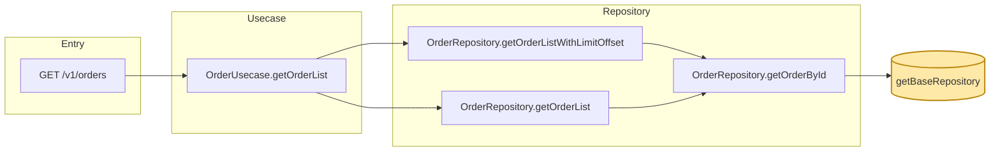

## ゴール

- 指定された関数（target）が、最終的にどのエントリポイント（API route / CLI / バッチ / イベントハンドラ等）まで影響するかを **caller chain** として可視化する
- 中間の関数・メソッド・モジュールの利用箇所も記す
- Mermaid フローチャートで出力し、根拠（`path:line`）を併記する

## 前提（プロジェクトごとに最初に把握する）

このスキルは特定の言語・構成を仮定しない。実行前に対象リポジトリについて以下を確認する:

- **言語 / ファイル拡張子**: ripgrep の `-t`（type）や `-g`（glob）に使う（例: `-t ts`, `-t py`, `-t go`, `-g '*.rb'`）
- **エントリポイントの置き場所**: API route / コントローラ / CLI / ジョブ / Lambda・関数ハンドラ / イベント購読など。これを `stop_at` のデフォルトに反映する
- **テストの置き場所**: 除外対象にする（例: `**/__tests__/**`, `**/*.test.*`, `**/*_test.*`, `**/spec/**`）
- **生成物・依存の置き場所**: 除外対象にする（例: `**/dist/**`, `**/build/**`, `**/node_modules/**`, `**/vendor/**`）

不明な場合はディレクトリ構成を概観してから手順に入る。

## 入力

ユーザーから以下を受け取る（不足時は確認する）:

- **target**: 対象関数。形式は次のいずれか
  - 関数名のみ（例: `getBaseRepository`）
  - `path:symbol` 形式（例: `src/models/order/repository.ts:getBaseRepository`）
  - `Class.method` 形式（例: `OrderRepository.getBaseRepository`）
- **stop_at**（任意）: 末端とみなすパスパターン。デフォルトはプロジェクトのエントリポイント置き場所（前提セクション参照）。例:
  - HTTP route / controller のディレクトリ
  - CLI / コマンドのディレクトリ
  - ジョブ / バッチ / 関数ハンドラのディレクトリ
- **max_depth**（任意）: 探索深さの上限。デフォルト `8`
- **roots**（任意）: 探索対象のルートディレクトリ。デフォルトはリポジトリ全体（生成物・依存は除外）

## 手順

### 1. target の特定

target が関数名のみの場合、定義箇所を ripgrep で特定する。言語に合わせて `<EXT>`（type/glob）を置き換える。

```bash
# 関数定義を探す（同名が複数ある可能性に注意）
# 例: 多くの言語で通用する緩めのパターン。言語固有の定義構文があれば優先する
rg -n "(?:function|def|fn|func|sub)\s+<NAME>\b|\b<NAME>\s*[:=]\s*(?:async\s*)?(?:function|\()" <ROOTS>
rg -n "\b<NAME>\s*\(" <ROOTS> -g '!**/__tests__/**' -g '!**/*test*'
```

複数候補がある場合はユーザーに確定させる。`Class.method` 形式の場合はクラス／型定義（例: `class <Class>`, `type <Class>`, `struct <Class>` 等）の存在も確認する。

### 2. caller の探索（再帰）

各レベルで caller を抽出し、`caller.set` に積む。

**主要ツール（優先順）:**

1. **言語サーバ / コードインテリジェンス（利用可能な場合）**: LSP の「参照検索（find references）」や serena MCP の `find_referencing_symbols` など、正確な参照を取得できる手段を最優先する
   - シンボルのフルパス（例: `OrderRepository/getBaseRepository`）と定義ファイルを指定する
2. **ripgrep（フォールバック / 主軸）**:

```bash
# call サイトを探す（メソッド呼び出し / 関数呼び出し）
rg -n "\b<NAME>\s*\(" <ROOTS> -g '!**/__tests__/**' -g '!**/*test*' -g '!**/dist/**' -g '!**/build/**' -g '!**/vendor/**'

# import / require / use 経由で使われているかも併せて確認
rg -n "(?:import|require|use|from)\b[^\n]*<MODULE>" <ROOTS>
```

**ノイズ除去:**

- 同名関数（別ファイルで定義）の誤検出を避けるため、検出ファイルの import / require 文を読み、対象モジュールから来ているかを確認する
- コメント内・テスト内の参照は除外する（テスト caller は別セクションに集約）
- 定義箇所自身（self）は除外

### 3. 各 caller の所属 layer を判定

path / 命名規約から layer を分類する（subgraph 化に使う）。レイヤー名と判定基準はプロジェクトの構成に合わせて調整する。代表的な分類例:

| Layer | 判定の手がかり（例） |
|-------|----------------------|
| Entry (Route/Controller/CLI/Handler) | route / controller / cli / handler / job / batch ディレクトリ |
| Usecase / Service | service / usecase / application 層 |
| Domain / Repository | model / domain / repository |
| Adapter / Gateway | adapter / gateway / infrastructure / client |
| Helper / Util | 上記以外 |

該当する層構造がないプロジェクトでは、ディレクトリ単位など実情に合った粒度で subgraph 化する。

### 4. 終端判定

caller が `stop_at` のパターンに合致したら、その caller を **エントリポイント** として記録し、それ以上は辿らない。`max_depth` に達した場合も停止し、その旨を出力に明記する。

### 5. Mermaid 出力

caller → callee の方向で矢印を書く（呼び出しの自然な向き）。target を最末端に配置する。



ノードラベルは `Class.method` または `path:symbol` の短縮形を使う。`(` `)` `/` `:` は Mermaid で問題になり得るので `[ ]` で囲み、必要なら `"..."` でクォートする。

## Hard rules

- 推測で断定しない。各エッジ（caller → callee）に `path:line` の根拠を 1 つ以上添える
- 同名衝突の可能性がある関数は **必ず import / require 元で確認**してから caller として採用する
- テスト（`__tests__/**`, `*.test.*`, `*_test.*`, `spec/**` 等）の caller は別セクションに分けて出力（ノイズ低減）
- 探索打ち切り条件（`stop_at` / `max_depth`）に該当した場合は、その旨を出力する
- 出力本文は日本語。識別子・パスは原文のまま

## 出力フォーマット

````
CALLGRAPH
=========

target: <Class.method or path:symbol>
定義: <path:line>
調査日: <YYYY-MM-DD>
対象ブランチ: <branch or commit>
探索条件: max_depth=<N>, stop_at=<patterns>

## エントリポイント一覧
- <種別/Method> <path> <概要>
- ...

## Mermaid（caller chain）

```mermaid
flowchart LR
    %% subgraph & nodes & edges
```

## caller chain（テキスト一覧）
- <Entry> ← <Usecase> ← <Repository> ← <target>
- ...

## エッジ根拠（path:line）
- <caller path:line> calls <callee>
- ...

## ノイズ／除外
- 同名衝突で除外: <path:line> （別モジュール由来）
- テスト caller: <path:line>

## 探索打ち切り
- max_depth 到達: <node>
- stop_at で停止: <node>

## 未確認 / 要確認
- <注釈>
````

## Notes

- 1 つの caller が複数の callee を呼ぶ場合は、エッジを別々に列挙する
- ルーティング経由（route 定義ファイル → handler 関数）は、HTTP method + path をエントリノードのラベルにする
- 起点関数が **オーバーロードされている**（同名で複数定義）ケースは、各定義ごとに独立した graph を作る
- 大規模になる場合は、サブグラフを「Layer」単位 + 「機能ドメイン」単位の二段階に分けても良い
- 動的ディスパッチ（インターフェース経由・DI・リフレクション・コールバック登録等）は静的検索で追えないことがある。検出できなかった可能性がある経路は「未確認 / 要確認」に明記する
